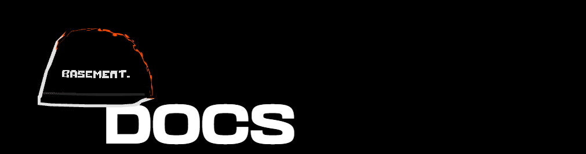

The following files document the core components and functions used to solve this challenge:

* ### [ThreePortal](./three-portal.md)
* ### [ThreeImage](./three-image.md)
* ### [ShaderStandardMaterials](./shader-standard-materials.md)
* ### [Hooks and stores](./hooks-and-stores.md)
