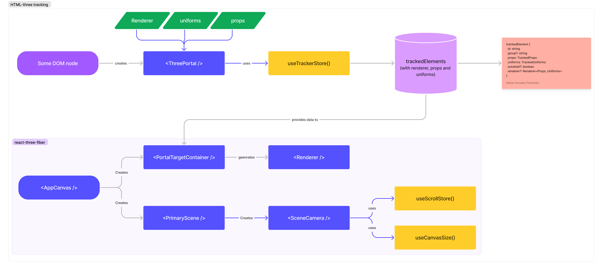

# [< ThreePortal](./README.md)

[ThreePortal source](../src/components/common/three-portal/index.tsx)

The experience I wanted to have when coding this site was to be able to seamlessly place 3D objects on the page as if they were part of the DOM. I wanted my code to look like this:

```tsx
export const AwwwardTropy = () => {

  const divRef = useRef(null)
  // measure size of div
  const elementRect = useRect(divRef.current)
  const someUniforms = useUniforms({})

  return (
    <div ref={divRef} className={s.someStyle}>
      <ThreePortal
        {/* the Three.js element to render */}
        renderer={AwwwardThreeComponent}
        {/* some props */}
        props={{ elementRect }}
        {/* some uniforms (as refs) */}
        uniforms={someUniforms}
        {/* automatically adds 3D element to the scene */}
        autoAdd
      />
    </div>
  )
}

const AwwwardThreeComponent = ({props, uniforms}) => {
  return (
    <mesh>...</mesh>
  )
}
```

This code automatically adds the `AwwwardThreeComponent` to the 3D scene, passing down props and uniforms provided in the portal.

In [this example](../src/app/sections/falling-caps/three-caps.tsx), the `CapTracker` element will be rendered on the dom, and the `CapPortal` will be added to the Three.js scene.

## How does it work



[Open tracker diagram](https://www.figma.com/file/1vy2AwbxqEVX6V3T2LO3dU/creative-dev-challenge?type=whiteboard&node-id=0%3A1&t=LejnEkZA9moYChKc-1)

When a [ThreePortal](../src/components/common/three-portal/index.tsx) is placed, it stores the _renderer, props and uniforms_ into a `zustand` store using the [useTrackerStore](../src/context/use-tracked-element.ts) hook.

Then, the [PortalTargetContainer](../src/components/common/three-portal/portal-target.tsx) renders all the elements with `autoAdd` set to true, providing the corresponding `props` and  `uniforms`.

## Example

Let's imagine we have the following interfaces:

```tsx
interface CapPortalProps {
  cap: Cap
  element: HTMLDivElement | null
}

interface PortalUniforms {
  fHover: number
}
```

> Note: The `ThreePortal` element has a type system to check if the `renderer` has the same props that are passed to the portal.

The Portal can be created like this:

```tsx
export const CapTracker = ({cap}) => {
  const element = useRef(null)

  // create state
  const [portalProps, setPortalProps] = useState<CapPortalProps>({
    cap,
    element: element.current
  })

  // updates a ref
  useEffect(() => {
    setPortalProps({
      element: element.current
    })
  }, [element.current])

  // create uniforms
  const [portalUniforms] = useUniforms<PortalUniforms>({
    fHover: 0
  })

  return (
    <div ref={element} className={s.capTracker}>
      <ThreePortal
        renderer={CapPortal}
        props={portalProps}
        uniforms={portalUniforms}
        autoAdd
      />
    </div>
  )
}
```

Finally, the renderer can be created like this:

```tsx
import type { TrackerRendererProps } from '~/context/use-tracked-element'
import type { Uniforms } from '~/hooks/use-uniforms'


type CapPortalProps = TrackerRendererProps<CapPortalProps, Uniforms<PortalUniforms>>

const CapPortal = ({props, uniforms}: CapPortalProps) => {

  // get props from portal
  const { element, cap } = props

  // calc position of element
  const rect = useClientRect(element)

  // calc center of element
  const centerX = rect.absoluteLeft + rect.width / 2
  const centerY = rect.absoluteTop + rect.height / 2
  const centerZ = 500

  // calc scale of element
  const scaleFactor = rect.width;

  return (
    <mesh
      scale={[scaleFactor, scaleFactor, scaleFactor]}
      position={[centerX, -centerY, centerZ]}
    >
    <Center>
        <Resize width>
          <primitive />
        </Resize>
      </Center>
    </mesh>
  )
}
```
